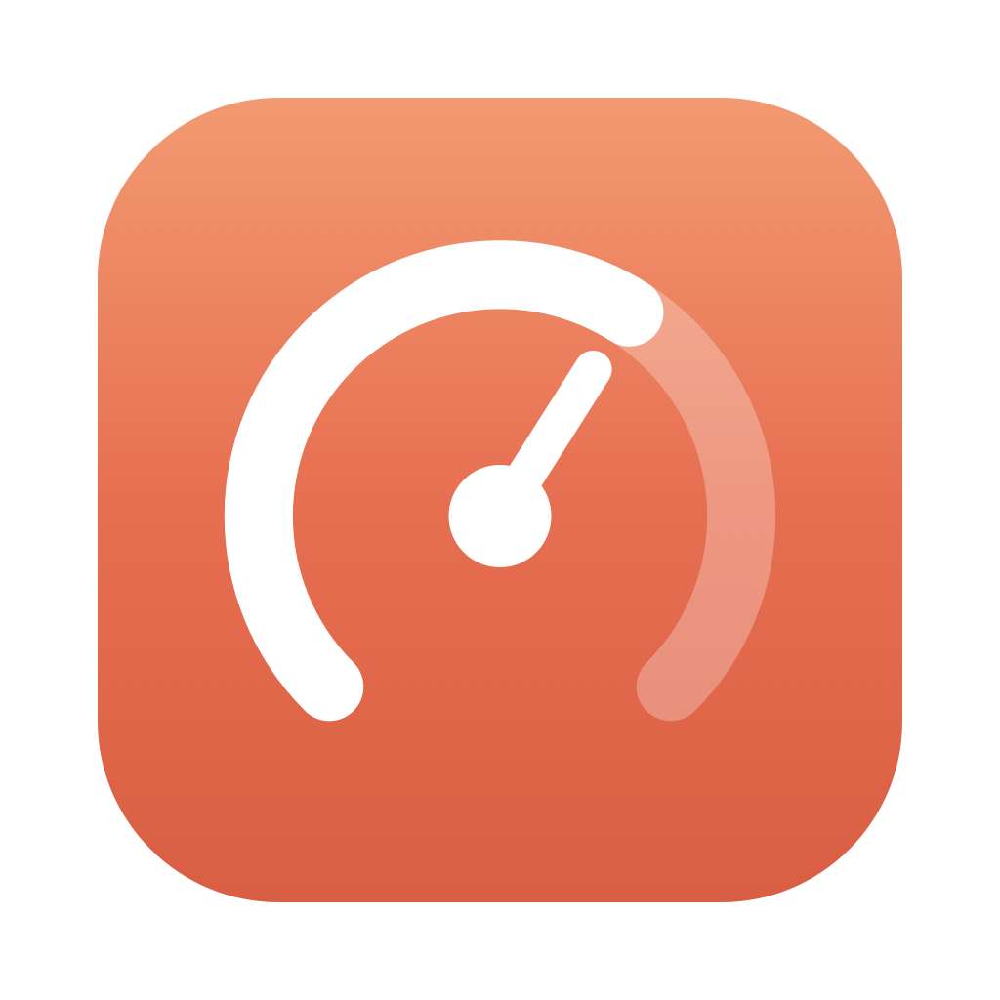
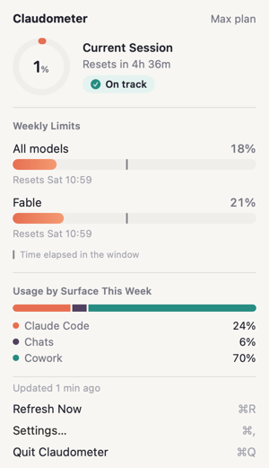
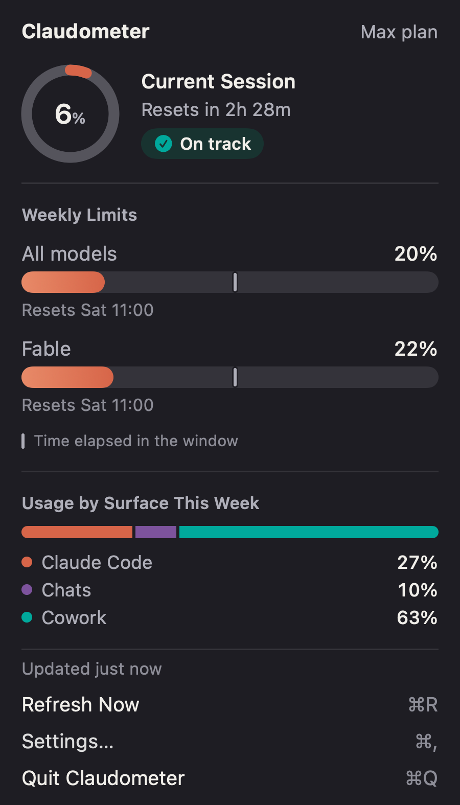
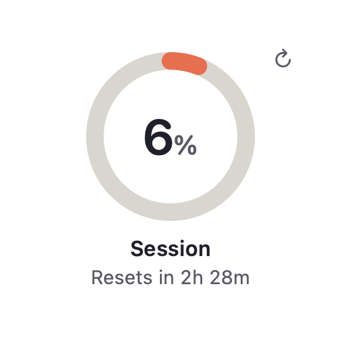
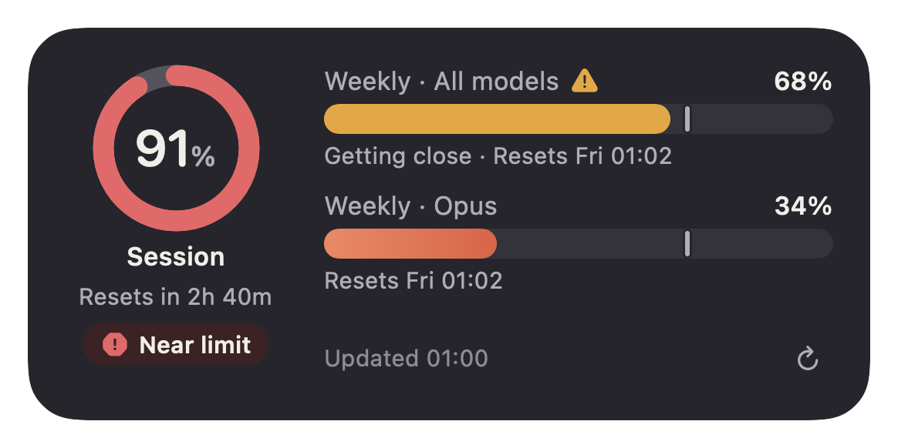

<p align="center"></p>

# Claudometer

A tiny macOS menu bar app (plus a desktop widget) that shows how much of your **Claude plan limits** you've used. It covers the 5‑hour session window and the weekly windows, each with a reset countdown.

<p align="center">
  
  <br><br>
  
  
</p>
<p align="center">
  
  
</p>

The full specification is in [TZ.md](TZ.md).

## Requirements

- macOS 14 Sonoma or later
- A Claude Pro/Max subscription and **Claude Code signed in** (`claude` → `/login`). Claudometer reuses that login.

## Install

Download the latest `Claudometer-x.y.z.dmg` from [Releases](https://github.com/Faithful-developer/claudometer/releases) and drag the app to Applications.
The app isn't notarized yet, so macOS blocks the first launch: open **System Settings → Privacy & Security** and click **Open Anyway**.
Claudometer checks for new releases once a day and shows **Update Available** in the menu; *Settings → About* has **Check for Updates**.

## Build & run (no Xcode needed)

```bash
scripts/build-app.sh             # → build/Claudometer.app (universal, ad-hoc signed)
scripts/build-app.sh --install   # copy to /Applications and launch
scripts/build-app.sh --dmg       # also package build/Claudometer-<version>.dmg
scripts/test.sh                  # unit tests (clean build; works around a CLT macro-plugin bug)
```

Swift Package Manager builds the menu bar app with only the Command Line Tools installed.

## Desktop widget (needs Xcode)

```bash
brew install xcodegen
scripts/build-xcode.sh      # app + widget → /Applications, launched
```

No Apple developer team is needed. The app and widget share data through `~/Library/Application Support/Claudometer/` instead of an App Group: the sandboxed widget has a read-only sandbox exception for that one folder. The shared code is linked statically into both, so library validation passes with local signing. After installing, right-click the desktop → **Edit Widgets…** → search "Claudometer".

## How it works

| Piece | What it does |
|---|---|
| `CredentialsProvider` | Reads Claude Code's OAuth token from the Keychain item `Claude Code-credentials` (read-only; never stored or logged) |
| `ClaudeWebClient` | Backup source: claude.ai's usage API with the `sessionKey` cookie you paste in *Settings → Login*. Used only while Claude Code's login is expired (Claude Code refreshes it only while running) |
| `UsageAPIClient` | `GET https://api.anthropic.com/api/oauth/usage` with `anthropic-beta: oauth-2025-04-20` |
| `UsageDecoder` | Tolerant parsing. Prefers the `limits` array and falls back to the legacy `five_hour` / `seven_day*` keys. Unknown limit kinds are still shown |
| `UsageStore` | Polls every 5 min by default (1–30). Backs off exponentially on errors (1→2→4→8→15 min), honours `Retry-After`, and refreshes on wake or when the network comes back |
| `NotificationManager` | Optional alerts at 80% / 95% (once per window per reset cycle) and when a limit resets |
| `SnapshotStore` | Last known state as JSON (`~/Library/Application Support/Claudometer/`, or the App Group in the widget build). Contains no token |

> ⚠️ The usage endpoint is **undocumented** and may change. If it does, Claudometer shows "Usage format not recognised" instead of wrong numbers.

## Project layout

```
Sources/ClaudometerCore/   models, decoder, API client, Keychain, backoff, thresholds, store
Sources/Claudometer/       SwiftUI menu bar app (MenuBarExtra), settings, notifications
Widget/                    WidgetKit extension (built via project.yml / Xcode)
Tests/                     swift-testing unit tests + real response fixture
scripts/                   build-app.sh, make-icon.swift
Config/                    entitlements for the Xcode build
TZ.md                      technical specification
```

## Design

Claudometer follows Apple's Human Interface Guidelines and looks like a built-in menu bar extra (Battery, Wi‑Fi, Control Center):
- **System look:** the window keeps the system material. Text uses hierarchical `.primary`/`.secondary`/`.tertiary` styles, so it picks up vibrancy, light/dark mode and Increase Contrast.
- **Light and dark:** follows the system by default. *Settings → General → Appearance* can pin Light or Dark.
- **Colours:** from the Claudometer palette ([docs/palette.html](docs/palette.html)). Meters use Meter Coral; Attention amber and Over-limit red take over near limits; status pills (On track / Ahead of pace / Getting close / Near limit) use each status colour on its soft tint. Dark mode uses matching dark steps of the same hues.
- **Warnings:** system orange and red appear only above your thresholds, always with an SF Symbol and a label.
- **Menu bar icon:** monochrome like other system icons until usage needs attention.
- **Actions:** full-width menu rows with keyboard shortcuts (⌘R, ⌘,, ⌘Q) and an accent-coloured hover highlight.
- **Settings:** toolbar tabs (General, Notifications, About) with grouped forms.
- **Meters:** capacity rings and bars, like the Batteries widget. A 2pt tick marks how much of the window's time has passed, so you can see your pace.
- **Usage by surface:** one stacked bar with a legend that lists each value. Series follow the palette order: Usage coral (Claude Code), plum (Chats), teal (Cowork). The dark steps were picked to keep the hues and still pass the data-viz colour-blind checks.
- **Shared code:** the components live in `Sources/ClaudometerCore/UI/`, so the popover and widgets match.

## Developer notes

- `Claudometer --render-previews <dir> [--sample high]` renders the menu bar icon, popover and all three widget sizes (light and dark) to PNGs, then exits. It uses the cached state, or made-up high-usage numbers with `--sample high`. It's used for the screenshots above.
- `swift scripts/make-icon.swift` regenerates `Resources/AppIcon.icns`.
- `scripts/release.sh 0.2.0 "notes"` builds the app with the widget, packages a DMG, tags `v0.2.0` and publishes the GitHub release. Always bump the version: the in-app update check compares it with the latest release.
- Notifications and launch at login only work from the bundled `.app`, not from `swift run`.
